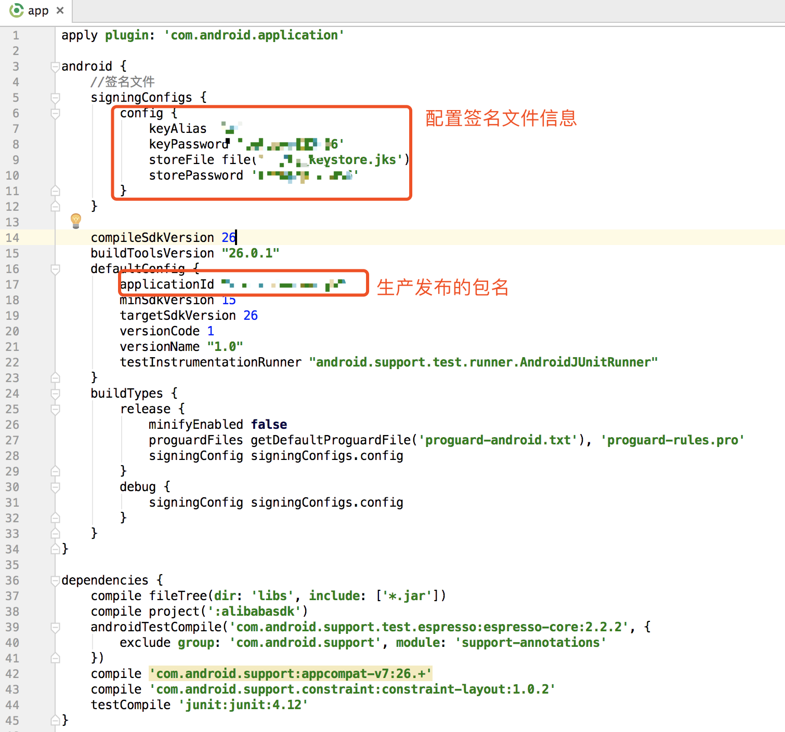

# 接入阿里百川SDK下载安全图片的Demo

#### 1、首先注册淘宝账号，申请成为阿里开发者

<https://open.taobao.com/>

#### 2、登录阿里百川，需要公司提供账户密码

<http://baichuan.taobao.com/>

#### 3、创建应用，不用多说，跳过

#### 4、申请相关的API功能权限，如下图：

#### 5、下载SDK包，如下图页面

#### 6、接下来就是创建Demo，记住，不能用android studio 3.0以上版本的IDE工具，这个阿里内部提供的demo是不行的，这个坑被踩了一天了，之前就是用AS3.0bata4版本，怎么生成的apk上传都不成功，结果第二天，采用AS2.3.3版本，重新新建Demo项目，结果按部就班的执行，就可以上传APK包，进行下载安全图片了。

#### 7、接下来如何重新制作APK，即Demo例子

	1.Demo目录结构

	2.在空的app下的build.gradle配置文件中，配置如下信息

	3.配置子module的alibabasdk中的信息，在AndroidManifest.xml文件中配置报名：<manifest package="com.alibaba.sdk.android.kernel"/>

	4.在根目录下的build.gradle文件中的，repositories里配置以下信息
	maven {
            url "http://repo.baichuan-android.taobao.com/content/groups/BaichuanRepositories/"
        }

	5.在alibabasdk的子目录下build.gradle文件中配置如下信息：
	//fastjson
    compile 'com.alibaba:fastjson:1.2.9'
    //支付
    compile 'com.alibaba.alipay:alipaySingle:20160825@jar'
    //登陆
    compile 'com.ali.auth.sdk:alibabauth_core:1.4.3@jar'
    compile 'com.ali.auth.sdk:alibabauth_ui:1.4.3@aar'
    compile 'com.ali.auth.sdk:alibabauth_ext:1.4.3@jar'
    //安全基础
    compile 'com.taobao.android:securityguardaar3:5.1.81@aar'
    //Mtop网关
    compile 'com.taobao.android:mtopsdk_allinone_open:1.2.2.4@jar'
    //applink
    compile 'com.alibaba.sdk.android:alibc_link_partner:1.1.0.0'
    //UT
    compile 'com.taobao.android:utdid4all:1.1.5.3_proguard@jar'
    compile 'com.alibaba.mtl:app-monitor-sdk:2.5.1.3_for_bc_proguard@jar'
    //联盟SDK
    compile 'com.alimama.tunion.sdk:tuniontradesdk:0.3.2'
    //电商SDK
    compile 'com.alibaba.sdk.android:alibc_trade_common:3.1.1.205'
    compile 'com.alibaba.sdk.android:alibc_trade_biz:3.1.1.205'
    compile 'com.alibaba.sdk.android:alibc_trade_sdk:3.1.1.205'
    
 

	6.最终打包注意事项，2个jar都选择，以后你的生存发布的包也要都选择。
	

	
#### 8、其实做完后，发现很简单，就是采用AS v2.3.3版本，不要太高，否则怎么搞都是失败，还有阿里百川的同志没提供好的Demo，以至于我们踩了很多坑。
#### 9、最后提供Demo下载地址：

<https://github.com/jiangqingbo/AlibabaSDKDemo>

<https://gitee.com/letopop/AlibabaSDKDemo>